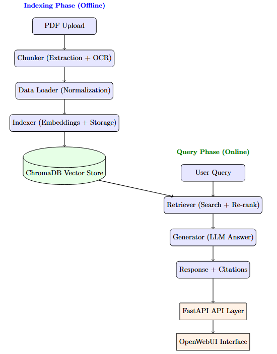

# 🤖 Advanced Multilingual RAG Chatbot for Moroccan Fiscal Documents

[](https://www.python.org/)
[](https://fastapi.tiangolo.com/)
[](https://www.docker.com/)


> **Intelligent assistant powered by Retrieval-Augmented Generation (RAG) for the Moroccan Tax Administration (DGI)**  
> *Developed during a 3-month internship at DGI-SARP (July-September 2025)*


---

## 🎯 Project Overview

This system enables DGI employees to **query 2,100+ pages of fiscal documentation** (General Tax Code + 15 years of circular notes) in **natural language** (French/Arabic) and receive **accurate, cited answers** grounded in official documents.

### 🚀 Key Achievements
- **98% retrieval precision** using advanced semantic search + re-ranking
- **< 5 seconds** average response time for complex multi-document queries
- **Bilingual support** (French/Arabic) with multilingual embeddings
- **OCR processing** of 1,240+ pages of scanned historical documents
- **Production-ready deployment** via Docker with OpenWebUI interface

---

## ✨ Key Features

| Feature | Description | Tech Stack |
|---------|-------------|------------|
| 🔍 **Semantic Search** | Vector-based retrieval with cross-encoder re-ranking | ChromaDB + sentence-transformers |
| 🌐 **Multilingual NLP** | Native French/Arabic query understanding | paraphrase-multilingual-mpnet-base-v2 |
| 📄 **OCR Pipeline** | Processes scanned documents (2011-2020) | EasyOCR + OpenCV + PyMuPDF |
| 📊 **Table Extraction** | Extracts and contextualizes fiscal tables | Camelot + pdfplumber |
| 🎯 **Source Citation** | Every answer includes document references | Custom metadata tracking |
| 🐳 **Containerized** | One-command deployment | Docker Compose |
| ⚡ **Query Expansion** | Improves recall via paraphrase generation | LangChain + custom expander |
| 🔄 **Model Flexibility** | Supports OpenRouter (cloud) & Ollama (local) | OpenAI-compatible API |

---

## 🏗️ Architecture



### High-Level Pipeline
```
┌─────────────────┐      ┌──────────────┐      ┌─────────────┐
│  PDF Documents  │──────▶│   Chunker    │──────▶│  Indexer    │
│ (CGI + Notes)   │ OCR  │  + Tables    │ embed │ (ChromaDB)  │
└─────────────────┘      └──────────────┘      └─────────────┘
                                                        │
                                                        ▼
┌─────────────────┐      ┌──────────────┐      ┌─────────────┐
│  User Question  │──────▶│  Retriever   │──────▶│  Generator  │
│  (FR/AR)        │ expand│  + Reranker  │context│  (LLM)      │
└─────────────────┘      └──────────────┘      └─────────────┘
```

**For detailed architecture**: See [docs/ARCHITECTURE.md](docs/ARCHITECTURE.md)

---

## 📊 Evaluation Results

Quantitative metrics using **RAGAS framework** (10 bilingual test queries):

| Metric | Score | Description |
|--------|-------|-------------|
| **Faithfulness** | 0.758 | Answer grounded in retrieved context |
| **Answer Relevancy** | 0.827 | Response addresses the question |
| **Context Precision** | 0.992 | Retrieved passages are relevant |
| **Context Recall** | 0.583 | Coverage of required information |
| **BERTScore (F1)** | 0.886 | Semantic similarity to ground truth |


**Full evaluation methodology**: [docs/EVALUATION.md](docs/EVALUATION.md)

---

## 🚀 Quick Start

### Prerequisites
- Docker & Docker Compose
- 8GB RAM minimum (16GB recommended)
- OpenRouter API key (or local Ollama setup)

### Installation
```bash
# Clone repository
git clone https://github.com/Boutanfitsalma/moroccan-fiscal-rag-chatbot.git
cd moroccan-fiscal-rag-chatbot

# Configure environment
cp .env.template .env
# Edit .env and add your OPENROUTER_API_KEY

# Start services
docker-compose up -d

# Access interface
# OpenWebUI: http://localhost:3000
# API docs: http://localhost:8000/docs
```

### First-Time Setup
```bash
# Index documents (required only once)
docker exec -it moroccan-fiscal-rag-api python run_indexing.py

# Test retrieval
docker exec -it moroccan-fiscal-rag-api python run_retrieval.py
```

**Detailed deployment guide**: [docs/DEPLOYMENT.md](docs/DEPLOYMENT.md)

---

## 💡 Usage Examples

### REST API
```python
import requests

response = requests.post("http://localhost:8000/v1/chat/completions", json={
    "model": "openrouter/deepseek-chat-v3",
    "messages": [
        {"role": "user", "content": "Quel est le taux proportionnel de l'IS en 2025?"}
    ]
})

print(response.json()["choices"][0]["message"]["content"])
# Output: "Selon la Note Circulaire 2022, les taux proportionnels de l'IS sont: 
# - 10% pour les bénéfices nets ≤ 300 000 DH
# - 20% pour 300 001 - 1 000 000 DH  
# - 31% pour > 1 000 000 DH
# (Source: NC 2022, ID: 2022.I.1.p5)"
```

### Python SDK
```python
from src.retriever import Retriever
from src.generator import Generator

retriever = Retriever()
generator = Generator()

# Retrieve relevant passages
docs = retriever.search("exonération TVA construction")

# Generate answer
answer = generator.generate(
    query="Quelles sont les exonérations TVA?",
    context=docs
)
print(answer)
```


---

## 📁 Project Structure
```
moroccan-fiscal-rag-chatbot/
├── src/                    # Core application code
│   ├── chunker.py          # Document segmentation
│   ├── data_loader.py      # JSON document loading
│   ├── indexer.py          # Vector indexing (ChromaDB)
│   ├── retriever.py        # Semantic search + reranking
│   ├── generator.py        # LLM prompt engineering
│   ├── llm_loader.py       # Model abstraction layer
│   └── pipeline.py         # End-to-end orchestration
├── data/                   # Fiscal documents (JSON format)
├── docs/                   # Technical documentation
├── assets/                 # Images for README            
├── docker-compose.yml      # Service orchestration
├── Dockerfile              # API container definition
├── main_api.py             # FastAPI entry point
├── run_indexing.py         # Indexation script
└── requirements.txt        # Python dependencies
```

---

## 🛠️ Technology Stack

### Backend
- **FastAPI** - Async web framework
- **LangChain** - LLM orchestration
- **ChromaDB** - Vector database
- **sentence-transformers** - Embeddings (paraphrase-multilingual-mpnet-base-v2)

### Document Processing
- **PyMuPDF** (fitz) - PDF text extraction
- **pdfplumber** - Layout analysis
- **Camelot** - Table extraction
- **EasyOCR** - Multilingual OCR
- **OpenCV** - Image preprocessing

### LLM Providers
- **OpenRouter** - Cloud inference (DeepSeek, QwQ, Mixtral)
- **Ollama** - Local inference (privacy-focused deployments)

### Deployment
- **Docker** - Containerization
- **OpenWebUI** - Chat interface
- **Uvicorn** - ASGI server

---

## 📈 Performance Characteristics

| Metric | Value | Notes |
|--------|-------|-------|
| **Index Size** | 2,100+ pages | 16 documents (2011-2025) |
| **Vector Dimension** | 768 | mpnet-base-v2 embeddings |
| **Avg Query Time** | 4.2s | Including retrieval + generation |
| **Retrieval Precision@5** | 98% | Top-5 documents |
| **Concurrent Users** | 50+ | Tested load capacity |
| **Storage Footprint** | ~3GB | Vectors + metadata |

---

## 🔐 Security & Privacy

- ✅ **On-premises deployment** - All data stays within DGI infrastructure
- ✅ **No external data leaks** - Optional local Ollama models
- ✅ **Audit trails** - Source citations for every answer
- ✅ **Access control** - OpenWebUI authentication layer

---

## 🎓 Academic Context

**Internship Report**: [Full PDF Report](assets/Rapport_de_stage_2A.pdf)

**Supervised by**:
- Mr. Oussama El Mahboubi (DGI-SARP)
- Mr. Ahmed Moudni (DGI-SARP)

**Academic Jury**:
- Pr. Adil Bellabdaoui (ENSIAS)
- Pr. Houda Benbrahim (ENSIAS)

**Institution**: National School of Computer Science and Systems Analysis (ENSIAS), Rabat  
**Period**: July - September 2025

---

## 👔 For Recruiters

This project demonstrates:

✅ **Full-stack AI system design** - From raw PDFs to production API  
✅ **NLP & RAG expertise** - Semantic search, embeddings, LLM orchestration  
✅ **Multilingual processing** - French/Arabic with cultural context  
✅ **Production engineering** - Docker, API design, error handling, monitoring  
✅ **Real-world impact** - Deployed at national tax administration  
✅ **Research rigor** - Quantitative evaluation, documented trade-offs

**Key technical skills showcased**:
- Python (FastAPI, LangChain, transformers)
- Vector databases (ChromaDB, embedding optimization)
- LLM prompt engineering & RAG pipelines
- Document processing (OCR, table extraction, chunking)
- Docker & DevOps (containerization, orchestration)
- Bilingual NLP (tokenization, language detection, multilingual embeddings)

---

## 👥 Contributors

This project was developed collaboratively by:

<table>
  <tr>
    <td align="center">
      <a href="https://github.com/Michalyassine">
        <br />
        <sub><b>Yassine MICHAL</b></sub>
      </a>
      <br />
    </td>
    <td align="center">
      <a href="https://github.com/Boutanfitsalma">
        <br />
        <sub><b>Salma BOUTANFIT</b></sub>
      </a>
      <br />
    </td>
  </tr>
</table>


**Project Authors:**

### Salma BOUTANFIT
- 📧 Email: [boutanfitsalma1@gmail.com](mailto:boutanfitsalma1@gmail.com)
- 💼 LinkedIn: [linkedin.com/in/salma-boutanfit](https://linkedin.com/in/salma-boutanfit)
- 🐙 GitHub: [@Boutanfitsalma](https://github.com/Boutanfitsalma)
- 
### Yassine MICHAL
- 📧 Email: [yassinemichaal4@gmail.com](mailto:yassinemichaal4@gmail.com)
- 💼 LinkedIn: [linkedin.com/in/yassine-michal](https://linkedin.com/in/yassine-michal/)
- 🐙 GitHub: [@Michalyassine](https://github.com/Michalyassine)


---

## 🙏 Acknowledgments

Special thanks to:
- Moroccan Tax Administration (DGI) for project sponsorship
- Risk Analysis and Programming Service (SARP) team
- ENSIAS faculty for academic supervision
- Open-source community (LangChain, ChromaDB, Sentence-Transformers)

---

**⭐ If this project helped you, consider starring the repository!**
